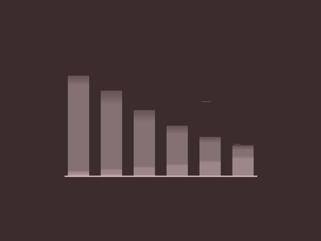

### Cybersecurity Enthusiast
- I'm an engineering student, and trying to study Cybersecurity in pararel. Python lover and future Pentest-Tools Developer.
- I'm currently learning.
- I'm looking for a job as cybersecurity analyst, network engineer or pentester.
- I have patience and time.
---
### How I spend my time?
- Working every day on HackTheBox or VulnHub, where i rezolve CTF or doing non-certify courses and trying to learn and understand python.
- Working 8h day on GsmService.
- Learning the Engineering Bases.
---
<h3 align="center">Latest Projects</h3>

  <a href="Working">
    #Coming Soon
  </a>

---
<h3 align="left"> Latest Videos</h3>

<!-- YOUTUBE:START -->
[Configuration NvChad And Nvim](https://youtu.be/om9Mnm5hrfk)

[Pentesting in Active Directory](https://www.youtube.com/watch?v=OK741JiH52g)

[Pivoting #pentesting](https://www.youtube.com/watch?v=fw1Uk_v1yiI)
<!-- YOUTUBE:END -->

---

<h3 align="center"> GitHub Stats</h3>

<table align="center">
  <tr>
    <td>
      
    </td>
    <td>
      
    </td>
  </tr>
</table>

---

<h3 align="center"> Languages and Tools</h3>

    
    
    
    

---

[youtube]: https://www.youtube.com/channel/UCcxU7lCoMDO3M4_MfPqEt3g
[instagram]: https://www.instagram.com/g.lazar.adrian/
[facebook]: https://www.facebook.com/ady.lazar.10/
